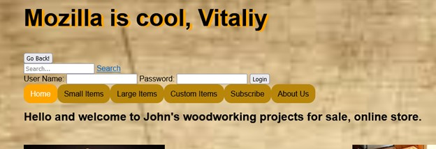
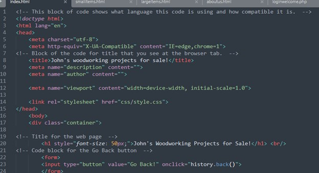
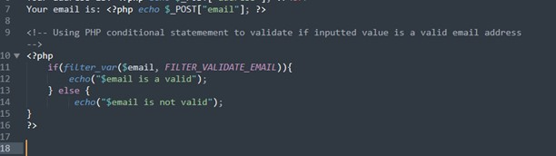
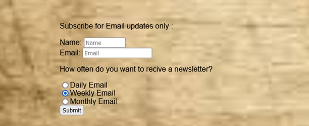
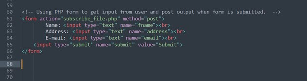
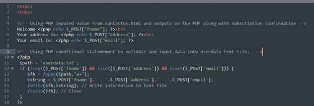
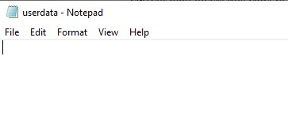
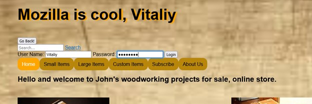
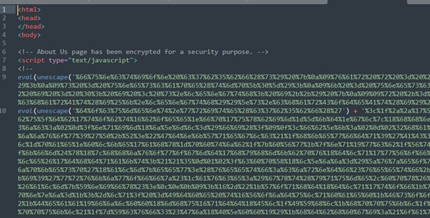

## Welcome to Vitaliy's CS-499 Final Project

## **7-1 Final Project Submission**

## **Professional Self-Assessment**

When I came to SNHU, I planned only to get my two-year degree in Information Technology just to prove to myself that I can do it. A few months later I have been promoted to Network Technician within my company. Another few months later I started getting a passion for this field and started looking into different BS degrees in the technology field. After researching and reading more about different degrees I leaned more toward Computer Science. I read that with a Computer Science degree I can almost work in any IT field. 

Coming into Computer Science, I had some experience in the networking field. My background gave me a passion for the Computer Science field. During these four-plus years, I have learned a lot about Computer Science and its different fields. I have learned a few different languages, and how to read, build, and understand the basics of coding. I have learned HTML, C++, Java, and Python. Throughout my Computer Science capstone class, I have learned the basics of PHP and how it works with HTML.

I have learned about security and how important it is. Cyber security engineers have to keep their equipment updated and monitored all the time. I have learned what algorithms are and their importance. Algorithms in the data structure can save time, eliminate unnecessary code lines, and they can make the program run more efficiently. In another class we learned databases and how to CRUD data. How to manipulate data to get wanted outcome results. I look forward to what I can accomplish with my knowledge in the real world now. 

## **Project Links**

- Original Code [Original Code] (https://github.com/rukivverh4/capstone.github.io/blob/gh-pages/Final%20-%20Original%20Code.zip)

## **Project Intro**

My artifact is the website I built during my CS-270 Web Site Design class. I have created one main home page and five other pages that you can access from it. The website is about the local woodworking shop and their items for sale. It includes different links for navigating around the site. I have decided to use this artifact over the other ones because I was more confident about it in the beginning. HTLM was one of the easiest languages to learn and understand for me. Diving more into the assignments, I have noticed that it’ll be a challenge. Although, I was excited to start working on it. 

**Software Design / Engineering**

For the Software Design/Engineering category, I chose to design and engineer my website even more. I have edited the navigation buttons at the top of the page to make them stand out for the user. To make it more appealing to the viewer, I have adjusted some of the text with the proper format. I have added the “Back” option on every page to make it easier for a user to navigate to a previously viewed page. To add to that, I have added a search option on the main page. In the background, in the code itself, I have alternative tags for pictures and added more comments throughout the code. Commenting on the code makes it easier for any developer to read and work on the code. It explains what each block of code does.

 
 
 
 
The experience from this category is that I have learned how I can manipulate the code even more to shape my navigation buttons and other things. The best practice to overcome challenges is to think from the user/viewer angle. I have asked myself what I would like to see on the page and how I would like to see it. 

**Algorithms and Data Structure**

For Algorithms and Data Structure, I had to come up with a solution that would solve a given problem in my code. I have learned that HTML itself does not use algorithms. So, I had to come up with another language to use along with HTML. I have decided to use PHP. Since I did not learn PHP in my previous class, I had to learn the basics of it on the go. However, I found PHP a little bit challenging for me. To showcase my skills and shine in this category I have decided to add a conditional “if” statement to my code to validate the email format inputted by the user. If the email is in the valid form, it’ll print that the “email is valid”. If the format of an email is not valid, it should give a user a message “email is not valid”.
 
 
 
 
 
From my experience and for a best practice, I have learned that it is a good thing to test your code as you go. Using HTML and PHP, I had one screen opened with my code, and on the other screen, I had my web page pulled up. So, whenever I make changes in the code or when I added another block of code, I always refreshed my web page on the other screen to see if my code still works or if it'll give me an error.  

**Databases**

For the Database category, I have chosen to add a table form on the subscribe page that would store user-inputted data into a text file or Excel file in the same folder. To solve this logic problem, I have created HTML and PHP code. HTML form code gets all information and POST it into PHP code, along with a welcome message. Then PHP code writes information into a text document.  

 
Behind the scenes, it saves inputted subscribe data into a newly created userdata.txt file.

  
Throughout the Computer Science degree program, I have learned that security is extremely important in every field. I have built a security mindset and was aware of it when I was working on this project. To enhance the security of my HTML web page I have created encrypted secured login. So, whenever a user signs into their account, their password is encrypted and not visible to others. 

 
To improve the security of the data structure, I have encrypted one of the HTML pages. I did not encrypt all of them because we won't be able to read the code while it is encrypted. As well, I have commented on HTML and PHP code to explain what each block of code does. For additional security, I have added visual copyright on every page.

